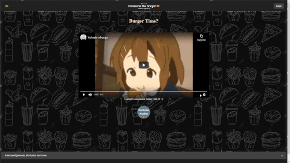

# <p align="center"> :hamburger: taghead.xyz :hamburger: </p>
[](https://github.com/taghead/taghead.xyz/actions/workflows/main.yml) [](https://taghead.xyz)
# <p align="center">  </p>

This web application live and hosted on https://taghead.xyz/. The focus of this repository is to learn.

The stack
- Framework: [NextJs](https://nextjs.org/)
- CSS Framework: [TailwindCSS](https://tailwindcss.com/)
- ORM: [Prisma](https://www.prisma.io/)
- Database: [MongoDB](https://www.mongodb.com/)

Management:
- Project Management: [ClickUp](https://sharing.clickup.com/b/h/7-6940650-2/659371618952c0f) informally following agile methodology

As the project develops and becomes more fleshed out, features will be tackled one at a time. The main objective is to learn and possibly achieving an appealing product. 

Feature List
- [ ] User Management
- [ ] User Generated Content
- [ ] Upload Video Links
- [ ] Voting System
- [ ] User Feedback System

## 1. Development

Download and Install :
- [Node.js (with npm)](https://nodejs.org/en/download/) - Used for building, development and testing.
- [Git](https://git-scm.com/downloads) - Used for collaborative software development

Clone the repository and install node.js modules.

```powershell
git clone https://github.com/taghead/taghead.xyz.git
cd .\taghead.xyz\
npm install -g yarn
yarn
```
Getting Started:
- First, run the development server `yarn dev`

- Open [http://localhost:3000](http://localhost:3000).

- [API routes](https://nextjs.org/docs/api-routes/introduction) can be accessed on [http://localhost:3000/api](http://localhost:3000/api).

- The `pages/api` directory is mapped to `/api/*`. Files in this directory are treated as [API routes](https://nextjs.org/docs/api-routes/introduction) instead of React pages.

To learn more about Next.js, take a look at the following resources:

- [Next.js Documentation](https://nextjs.org/docs) - learn about Next.js features and API.
- [Learn Next.js](https://nextjs.org/learn) - an interactive Next.js tutorial.

## Deployment

Options are: 
- Docker ( Preferred )
- NodeJS
- Vercel
- AWS
- More available at https://nextjs.org/docs/deployment


## 3. Additional Information
#### 3.1. Forgot TypeScript? 
Give the [/docs/typescript_refresher.md](/docs/typescript_refresher.md) a read. Hopefully, it will help you out.

#### 3.2. The project charter
Located in [/docs/project_charter.md](/docs/project_charter.md). It's nothing special, more so convention.

#### 3.3 Contributing 
Read the [CONTRIBUTIONS.md](/CONTRIBUTIONS.md)

#### 3.4 Technical Document
Read the [/docs/technical_documentation.md](/docs/technical_documentation.md)

This is a [Next.js](https://nextjs.org/) project bootstrapped with [`create-next-app`](https://github.com/vercel/next.js/tree/canary/packages/create-next-app).